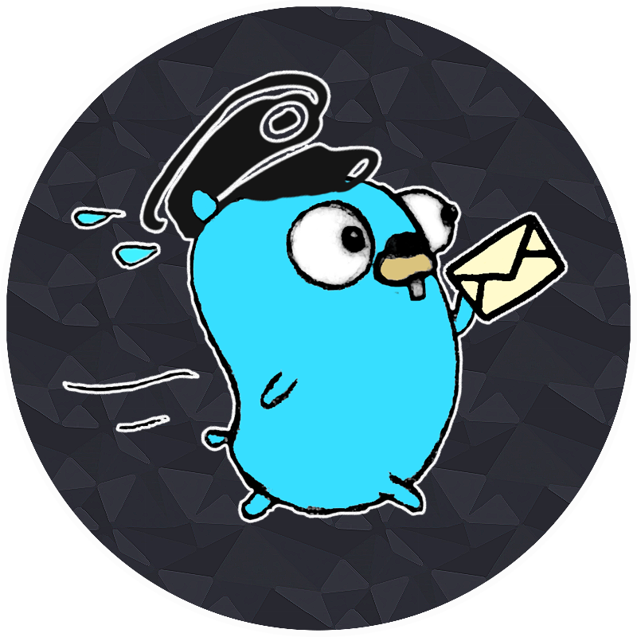
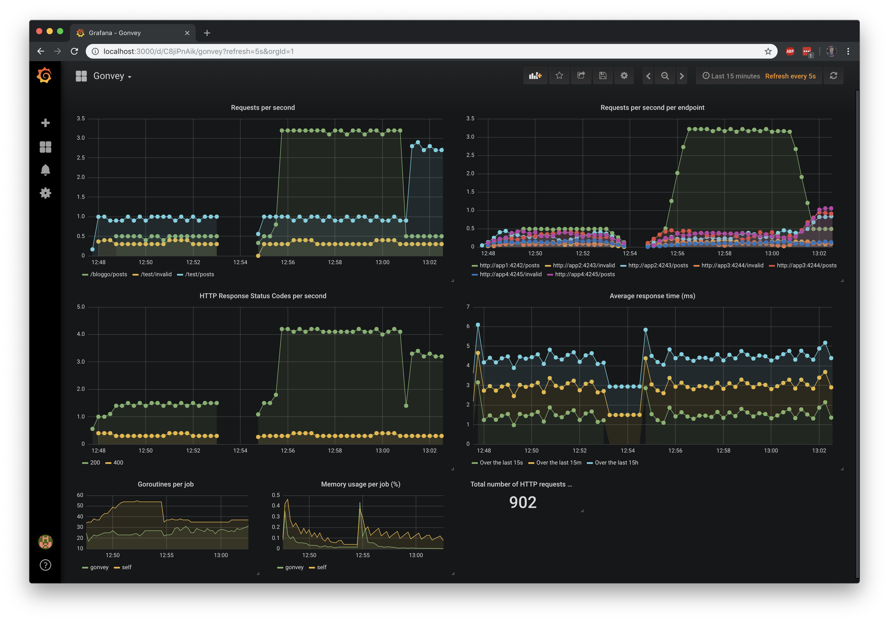
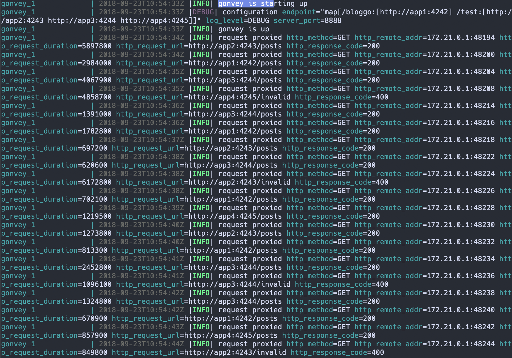

# Gonvey

Gonvey is a simple reverse proxy. It has a very basic load balancing that consists of randomly forwarding requests to one of the endpoints that matches the requests' path, and is configurable. It also comes with a stack of docker containers providing metrics and metrics visualization out of the box.

    

    
    
    
    

## Table of content

* [How to run it](#how-to-run-it)
* [Services](#Services)
* [Configuration](#Configuration)
* [Screenshots](#Screenshots)
* [License](#license)

## How to run it

* `docker-compose up`

## Services

In the `docker-compose.yml` file, other services are specified to be running alongside `Gonvey`.

### Metrics

The metrics service uses Prometheus to store the following metrics:

* The basic `promhttp` metrics
* `http_response_time`
* `http_requests_count` (with labels:)
  * `http_method`
  * `http_request_uri`
  * `endpoint`
* `http_remote_addr`
* `http_response_code`

### Metrics Gateway

This service is used to allow for Gonvey to push its metrics to `Metrics` using custom labels.

### Metrics Dashboard

This service uses Grafana to display a pre-configured dashboard that uses `Metrics` as its source.

    

Once you ran `docker-compose up`, you can find it by visiting `localhost:3000` in your favorite browser.

### Apps

The `apps` (`app1`, `app2`, `app3` and `app4`) are dummy applications that are set as the default endpoints for Gonvey. They return `200 OK` on their `/posts` endpoint, and `400` on other routes.

## Configuration

Gonvey is configured using the environment. The simplest way is to edit the environment variables in the `docker-compose.yml` file at the root of the repository.

Here is an example with the default configuration values:

    

------------------------

### `GONVEY_LOG_LEVEL`

Sets the log level. Default value is `DEBUG`.

Examples: `DEBUG`, `INFO`, `WARNING`, `ERROR`, `FATAL`.

------------------------

### `GONVEY_SERVER_PORT`

Sets the port used by the proxy. Default value is `8888`.

Can be any value between `1` and `65535`.

------------------------

### `GONVEY_PROXY_MAP`

Sets the paths and endpoints that are bound within the proxy. For now, it's stored in a JSON-encoded string. Default value is `{"/bloggo":["http://app1:4242"],"/test":["http://app2:4243","http://app3:4244","http://app4:4245"]}`.

Note that paths are matched in a random order, so if a proxy map is like such for example:

`{"/test/deep/bind":["http://app2:4243"],"/test":["http://app1:4242"]}`

And a request comes in for `/test/deep/bind`, it might go to either `app1` or `app2`. (This is because maps are unordered in go)

Examples:

* `{"/test1":["http://app1:4242"]}`
* `{"/api/v1":["http://app1:4242"],"/api/v2":["http://app2:4243"],"/api/v3":["http://app3:4244"],"/api/v4":["http://app4:4245"]}`

------------------------

## Screenshots

    

## License

Licensed under the Apache License, Version 2.0 (the "License");
you may not use this file except in compliance with the License.
You may obtain a copy of the License at http://www.apache.org/licenses/LICENSE-2.0

Unless required by applicable law or agreed to in writing, software distributed under the License is distributed on an "AS IS" BASIS, WITHOUT WARRANTIES OR CONDITIONS OF ANY KIND, either express or implied.

See the License for the specific language governing permissions and limitations under the License.
